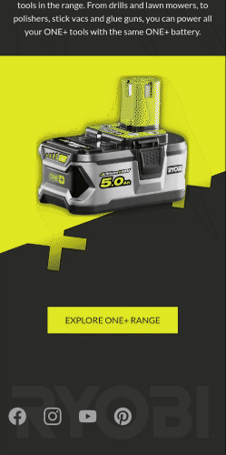

# About

This is a product page example rewritten from the ground using @angular and based on the real Ryobi's site made with react - https://uk.ryobitools.eu/technologies/one-hp/

If you are not familiar with github pages - you can check the final result at https://elobuho.github.io/ryobi-hp-static/

I have done it on my own, just for the demonstration purpose, as this manufacturer's outstanding branding was an interesting example to follow.

# Things I'm happy with

## rxjs - stream from event processing

On scroll down header should be hidden, but scrolling up should bring the header down to your finger/pointer, with an exception to the above-the-fold region where it's easily reachable anyway.

    this.scrollSub = fromEvent(this.documentRef, 'scroll')
      .pipe(
        debounceTime(500),
        // Check if header should be fixed, return boolean
        map(() => {
          // On top
          if (this.windowRef.scrollY < this.windowRef.innerHeight) {
            return false;
          }
          // Detect scroll up
          // Add some margin for content jumping on overlay display
          if (this.windowRef.scrollY < this.scrollYbefore + 50) {
            return true;
          } else {
            return false;
          }
        }),
        // Save current scroll position for later checks
        tap(() => {
          this.scrollYbefore = this.windowRef.scrollY;
        }),
        // Do nothing if status didn't change
        distinctUntilChanged(),
        // Switch css class
        tap((isFixed) => {
          if (isFixed) {
            this.renderer.addClass(this.documentRef.body, this.fixedClass);
          } else {
            this.renderer.removeClass(this.documentRef.body, this.fixedClass);
          }
        })
      )
      .subscribe();

## Menu Module

Menu Module provides a configurable service and two dummy components - a hamburger icon and an overlay with links. The module is configurable via injection token, which makes it more universal and reusable. Items could be edited with some setter if needed.

    @Injectable({
      providedIn: 'root',
    })
    export class MenuService {
      private _menuItems: MenuItem[] = [];
      private isMenuVisible = new BehaviorSubject(false);
      isMenuVisible$ = this.isMenuVisible.asObservable();
      get menuItems() {
        return this._menuItems;
      }

      constructor(@Optional() @Inject(MENU_ITEMS) providedMenuItems: MenuItem[]) {
        if (providedMenuItems) {
          this._menuItems = [...this.menuItems, ...providedMenuItems];
        }
      }

      toggleMenu() {
        this.isMenuVisible.next(!this.isMenuVisible.value);
      }
    }

    export const MENU_ITEMS = new InjectionToken<MenuItem[]>('Menu items list.');

    export interface MenuItem {
      href: string;
      caption: string;
    }

Both components' states are switched by the MenuService using observable and provided method.
Default configuration is provided in the App Module and used once menu object gets created:

      providers: [
        {
          provide: MENU_ITEMS,
          useValue: [
            { href: '#about-hp', caption: 'About HP One+' },
            { href: '#compact', caption: 'Compact design' },
            { href: '#batteries', caption: 'Batteries' },
          ],
        },
      ],

Honorable mention - as javascript events propagate up the DOM tree by default, a click handler is caught on the ul element, not each item individually.

    

      

        <ul
          *ngIf="menu.menuItems"
          class="text-gray-400 text-lg -ml-4"
          (click)="onMenuItemClick($event)"
        >
          <li *ngFor="let item of menu.menuItems">
            <a
              href="{{ item.href }}"
              class="block px-8 py-2 uppercase hover:text-gray-100"
              >{{ item.caption }}</a
            >
          </li>
        </ul>
      

    

## Social links directive

While creating a component for social links could be an overkill, I found a directive useful here. It adds some otherwise repeatable attributes, adds a css class on click and holds redirection until the css animation completes.

    export class SocialLinkDirective {
      constructor(el: ElementRef) {
        const url = el.nativeElement.href;
        el.nativeElement.setAttribute('target', '_blank');
        el.nativeElement.setAttribute('rel', 'noreferrer');

        el.nativeElement.addEventListener('click', (ev: Event) => {
          ev.preventDefault();
          el.nativeElement.classList.add('click');
        });

        el.nativeElement.addEventListener('animationend', () => {
          window.open(url);
          el.nativeElement.classList.remove('click');
        });
      }
    }

## Read More Arrow component

For the Read More component I decided to do the opposite and wrap any given content into a link with some fancy animated arrow on top. Of course, more config options could be provided using @Input decorator, like an arrow direction, etc.
In this approach, any content inside component's selector gets projected by replacing an ng-content selector.

    <a href="{{ target }}" (click)="onClick($event)"><ng-content></ng-content></a>

## Annoying issue with assets path finally solved

Do you know how to set assets' paths in styles? Well, there's only one answer - relative to the URL. But what if you will build a project with `--base-href` param set to something different than `/` ? - Paths will break and assets will not be available.
To solve this issue I introduced one additional variable in my SCSS setup

    $base-href: '/ryobi-hp-static';

While it's still not perfect, as you need to adjust it per build, it works good-enough and is used like

    background-image: url("#{$base-href}/assets/cross-fill-white.svg");

## PWA support

Since it's just few cli commands away, I have done it.
